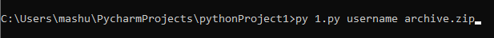
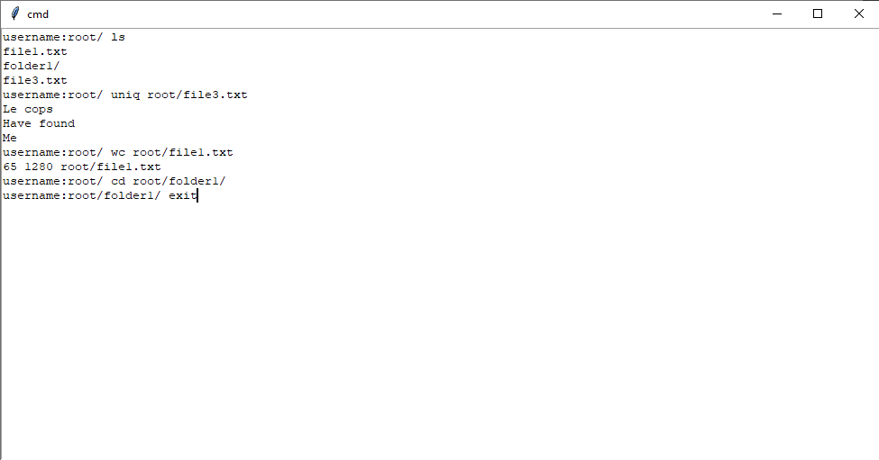

# Вариант № 30
## Задание №1
### Условие
Разработать эмулятор для языка оболочки ОС. Необходимо сделать работу
эмулятора как можно более похожей на сеанс shell в UNIX-подобной ОС.
Эмулятор должен запускаться из реальной командной строки, а файл с
виртуальной файловой системой не нужно распаковывать у пользователя.
Эмулятор принимает образ виртуальной файловой системы в виде файла формата
zip. Эмулятор должен работать в режиме GUI.

Ключами командной строки задаются:

• Имя компьютера для показа в приглашении к вводу.

• Путь к архиву виртуальной файловой системы.

Необходимо поддержать в эмуляторе команды ls, cd и exit, а также
следующие команды:
1. uniq.
2. wc.

Все функции эмулятора должны быть покрыты тестами, а для каждой из
поддерживаемых команд необходимо написать 3 теста
### Решение
Был разработан эмулятор терминала на python, поддерживающий необходимые команды.

Запуск программы с аргументом архива файловой системы

Работа эмулятора

